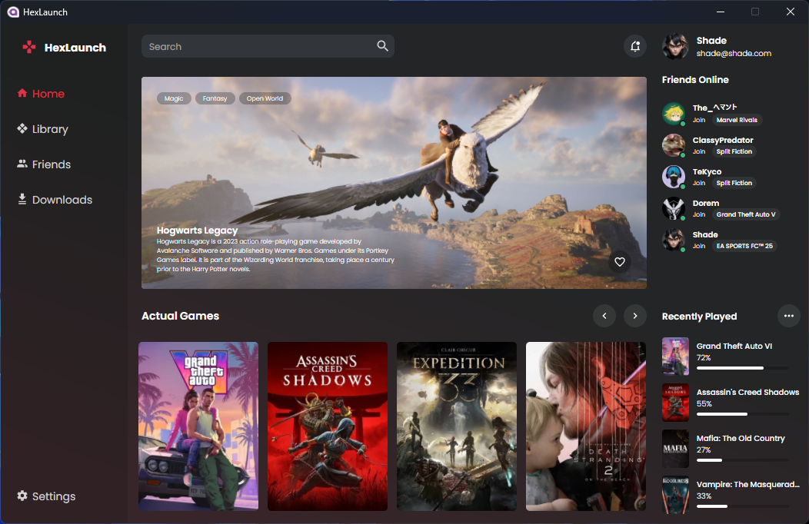
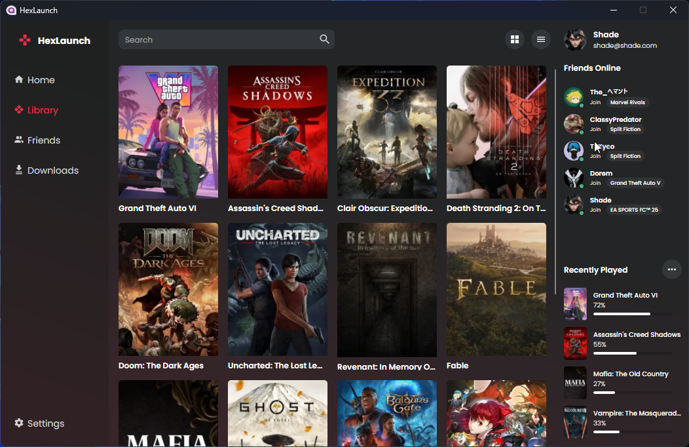
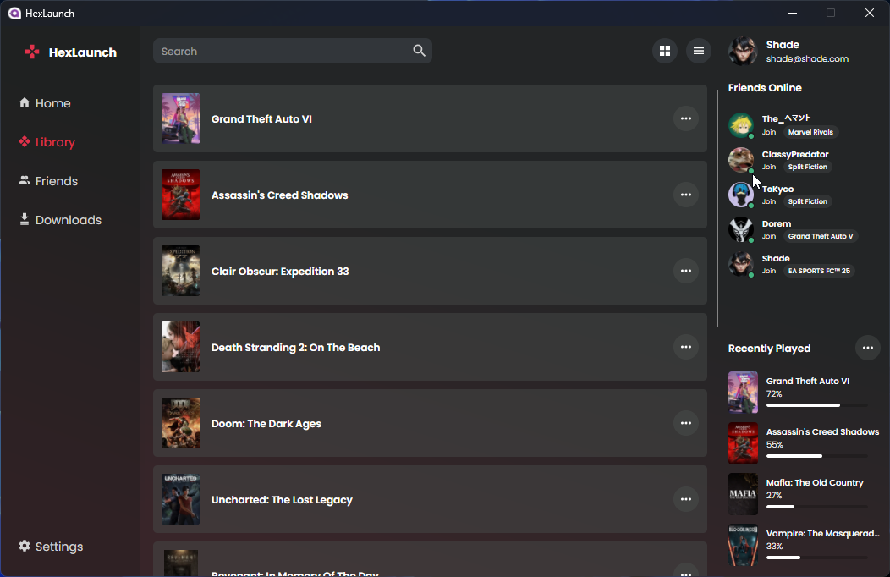
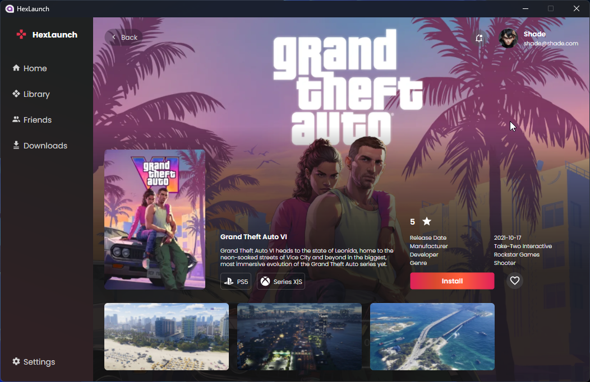

# Game Library UI

A prototype UI for a game library built using Avalonia UI.

## Screenshot





[](HexLaunch/Assets/Demo.mp4)


## Features
- Browse and manage your game collection
- Modern and responsive UI
- Built with Avalonia UI and MVVM pattern

## Requirements
- .NET 9 or later
- Avalonia UI

## Installation
1. Clone the repository:
   ```sh
   git clone https://github.com/shade-sdev/AvaloniaGameLibrary.git
   ```
2. Navigate to the project directory:
   ```sh
   cd GameLibraryUI
   ```
3. Build and run the application:
   ```sh
   dotnet run
   ```

## Contributing
Feel free to fork the project and submit pull requests with improvements or new features.

## License
This project is licensed under the MIT License.

